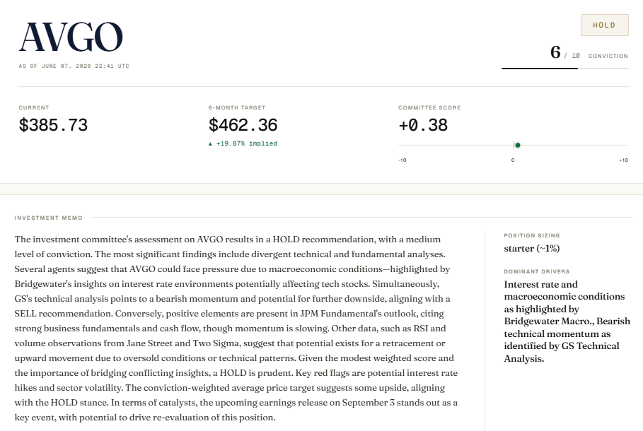

<div align="center">

# EquityTrader

### A multi-strategy investment committee, in your terminal.
### Eight specialist agents. One ticker. One verdict.

<br>


</div>

<br>



<br>

## What it is

EquityTrader convenes eight specialist analysts modeled after the desks of the world's most respected investment houses, then synthesizes their structured verdicts into a single Buy / Hold / Sell recommendation over a 3 to 6 month horizon.

Each specialist reasons independently with its own toolset and persona. A committee orchestrator reads all seven verdicts, computes a deterministic weighted score, and writes a portfolio manager style memo with position sizing, stop loss, and a real catalyst calendar pulled live from market data.

The system is built for actual buyside use. Every number is sourced. Every catalyst date is real. The committee score is auditable down to the contribution of each agent.

<br>

## The committee

| Specialist | Discipline | Default Weight |
|---|---|---:|
| J.P. Morgan | Fundamental | 25% |
| Bridgewater Associates | All-Weather Macro | 18% |
| Goldman Sachs | Technical | 12% |
| Citadel | Quantitative | 12% |
| Jane Street | ETF & Basket Flow | 10% |
| D. E. Shaw | Options-Derived | 10% |
| Renaissance Technologies | Pattern Recognition | 8% |
| Two Sigma | Backtest Sanity | 5% |

Each persona has its own multi-bullet analysis framework, its own tool set, and its own voice. The orchestrator can override the default weights when conviction or data quality justifies it, but must explain the override in writing.

<br>

## Quick start

This project uses [uv](https://docs.astral.sh/uv/) for dependency management. uv installs Python itself if needed, so it is the only prerequisite.

### 1. Install uv (one-time)

**macOS / Linux:**
```bash
curl -LsSf https://astral.sh/uv/install.sh | sh
```

**Windows (PowerShell):**
```powershell
powershell -ExecutionPolicy ByPass -c "irm https://astral.sh/uv/install.ps1 | iex"
```

Alternatives: `pip install uv`, `pipx install uv`, `brew install uv`. See [uv install docs](https://docs.astral.sh/uv/getting-started/installation/) for more.

### 2. Clone and set up the project

```bash
# Clone
git clone https://github.com/lenamonj/equity-trader.git
cd equity-trader

# Configure API keys
cp .env.template .env
# Edit .env: at minimum OPENAI_API_KEY, FRED_API_KEY, SEC_EDGAR_USER_AGENT_EMAIL

# Install Python 3.11 (auto) and all dependencies into a local .venv
uv sync
```

`uv sync` reads `pyproject.toml` and `uv.lock`, installs the pinned Python toolchain into a project-local `.venv/`, and resolves every dependency reproducibly. No global Python install, no manual venv activation.

### 3. Run

```bash
# CLI: rich-formatted terminal report
uv run python run.py AAPL

# Web UI with hot reload (development)
uv run gradio app.py
# Opens at http://127.0.0.1:7860

# Web UI without hot reload (production)
uv run python app.py
```

Required API keys (free tiers are sufficient):

| Key | Source | Cost |
|---|---|---|
| OPENAI_API_KEY | platform.openai.com | Pay as you go, ~$0.20 to $0.40 per ticker run |
| FRED_API_KEY | fred.stlouisfed.org | Free |
| SEC_EDGAR_USER_AGENT_EMAIL | Your email | Free (required by SEC) |

<br>

## Architecture

```
                    ticker
                      |
              reset per-run cache
                      |
        Semaphore(3) gated asyncio.gather:
          - JPM Fundamental
          - Bridgewater Macro
          - GS Technical
          - Citadel Quant
          - Jane Street ETF
          - DE Shaw Options
          - Renaissance Pattern
          - Two Sigma Backtest
                      |
            8 structured AgentVerdicts
                      |
                Orchestrator
        (deterministic weighted score
         + LLM-judged synthesis memo
         + real catalyst injection)
                      |
              OrchestratorVerdict
                      |
        persist (SQLite + JSON snapshot)
                      |
              render in UI / CLI
```

Each specialist is a standalone OpenAI Agents SDK agent with output_type=AgentVerdict. The fan-out is rate-limited to 3 concurrent calls (Semaphore) with exponential backoff on RateLimitError, so the eight agents finish in roughly 30 to 50 seconds end-to-end. The orchestrator is given the ticker's current price, today's date, and a real catalyst calendar fetched live from yfinance, so its output cannot hallucinate temporal facts.

<br>

## How the verdict is computed

The committee score is a deterministic weighted sum:

```
score = sum( sign(recommendation) * conviction * weight ) / 100
```

where sign(BUY)=+1, sign(HOLD)=0, sign(SELL)=-1, conviction is 1 to 10, and weights sum to 100. The theoretical range is -10 to +10; realistic readings land between -5 and +5.

If an agent errors out, its weight is redistributed proportionally to the survivors so the score stays calibrated.

The LLM orchestrator reads the score, the full agent verdicts, today's date, the ticker's current price, and the real catalyst calendar, then writes a 150 to 300 word memo. It may override the default weights if conviction or data quality justifies it, but the override rationale becomes a required field in the output.

The committee score is stamped deterministically after the LLM call, along with the run timestamp, current price, and agent verdicts. The model cannot fabricate them.

<br>

## Data sources

All free; no paid feeds.

| Source | Used for |
|---|---|
| yfinance | OHLCV history, fundamentals, options chains, analyst targets, peer sets, earnings/dividend calendar |
| SEC EDGAR | 10-K, 10-Q, 8-K filings (no key required; SEC requires a User-Agent with email) |
| FRED | Macro series (DGS10, DGS2, T10Y2Y, CPI, UNRATE, FEDFUNDS, NFCI, VIX) |

All data tools are memoized per-run via a ContextVar cache, so the seven parallel agents share fetches without hammering APIs.

<br>

## Tech stack

- Python 3.11+ with [uv](https://docs.astral.sh/uv/) for dependency management
- [OpenAI Agents SDK](https://github.com/openai/openai-agents-python) for tool-using agents with structured output
- GPT-4o-mini for the eight specialists, GPT-4o for the orchestrator
- Pydantic v2 for structured output validation
- Gradio for the web UI (hot-reload via gradio app.py)
- Rich for the CLI
- SQLite + JSON for run persistence
- pytest + respx for tests (unit + integration tier)

<br>

## Project layout

```
equity-trader/
├── app.py                      # Gradio UI entry point
├── run.py                      # CLI entry point
├── pyproject.toml              # uv project + dependencies
├── .env.template               # required environment variables
├── equity_trader/
│   ├── config.py               # model routing + default weights
│   ├── schemas.py              # Pydantic: AgentVerdict, OrchestratorVerdict
│   ├── exceptions.py
│   ├── scoring.py              # deterministic weighted score
│   ├── orchestrator.py         # LLM synthesizer + mechanical fallback
│   ├── runner.py               # async fan-out with rate-limit handling
│   ├── persistence.py          # SQLite + JSON snapshots
│   ├── data/
│   │   ├── cache.py            # per-run ContextVar cache
│   │   ├── yfinance_tools.py
│   │   ├── edgar_tools.py
│   │   ├── fred_tools.py
│   │   └── calendar_tools.py   # real upcoming catalysts
│   └── agents/
│       ├── base.py             # agent factory + shared rules
│       ├── jpm_fundamental.py
│       ├── bridgewater_macro.py
│       ├── gs_technical.py
│       ├── citadel_quant.py
│       ├── jane_street_etf.py
│       ├── de_shaw_options.py
│       ├── renaissance_pattern.py
│       └── two_sigma_backtest.py
├── tests/                      # 57 unit + integration tests
└── docs/
    ├── design/                 # full system design spec
    ├── plan/                   # 30-task TDD implementation plan
    └── screenshots/
```

<br>

## Testing

```bash
# Unit tests (mocked LLM, mocked data), ~3s
uv run pytest -m "not slow"

# Integration tests (real yfinance, EDGAR, FRED calls)
uv run pytest -m slow

# Full suite
uv run pytest
```

Mock layer covers all 8 agents, the orchestrator, the runner, the scoring math, persistence, the cache, and the schemas. Integration tests hit real APIs on stable tickers (AAPL).

<br>

## Roadmap

- [ ] Backtest harness: join persisted runs to forward returns, grade verdicts by agent
- [ ] Inter-agent debate round: let specialists see each other's calls and revise once before the orchestrator decides
- [ ] Multi-ticker watchlist with scheduled daily runs (cron + SendGrid digest)
- [ ] News sentiment via Finnhub free tier
- [ ] Position-aware orchestration: read current portfolio from Aladdin/Bloomberg export
- [ ] Re-introduce model diversity when a multi-provider SDK reliably handles tool calls plus structured output (currently Gemini's OpenAI-compat shim cannot do both)

<br>

## Design docs

The full design spec and implementation plan are checked in for transparency.

- [System design spec](docs/design/2026-06-07-equitytrader-design.md): architecture, agent specs, schemas, data layer, orchestrator policy
- [Implementation plan](docs/plan/2026-06-07-equitytrader-implementation.md): 30-task TDD plan with verifiable checkpoints

<br>

## Built with

- [Claude Code](https://claude.com/claude-code) for design, implementation, and review
- [OpenAI Agents SDK](https://github.com/openai/openai-agents-python)
- [Gradio](https://gradio.app/)

<br>

## License

[MIT](LICENSE). Copyright (c) 2026 Jeff Lenamon.
